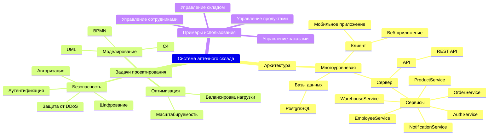
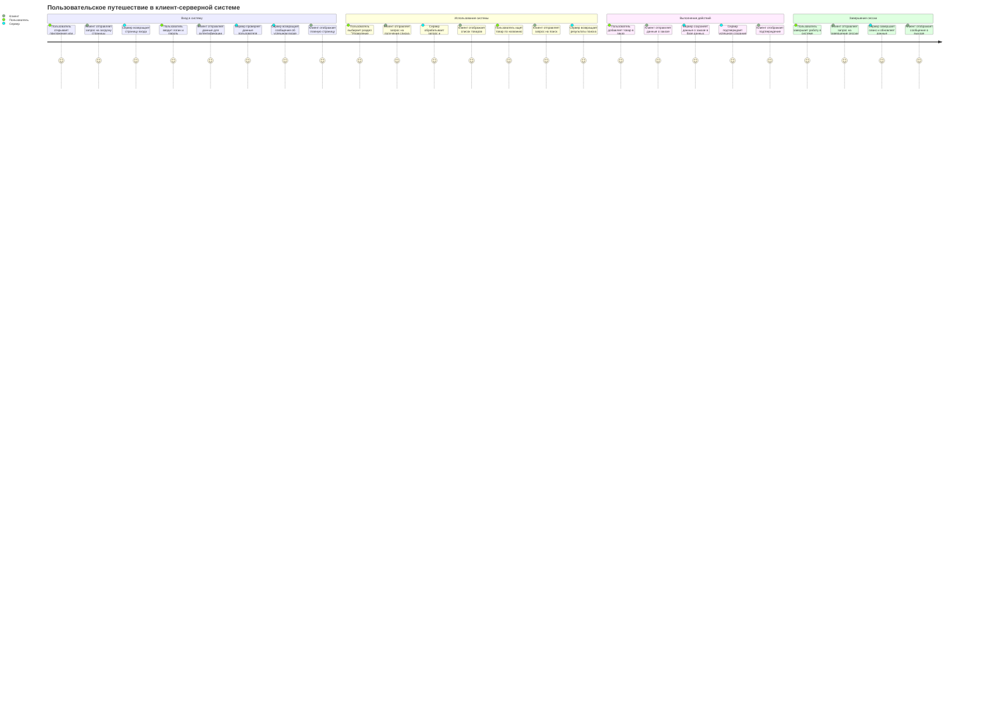
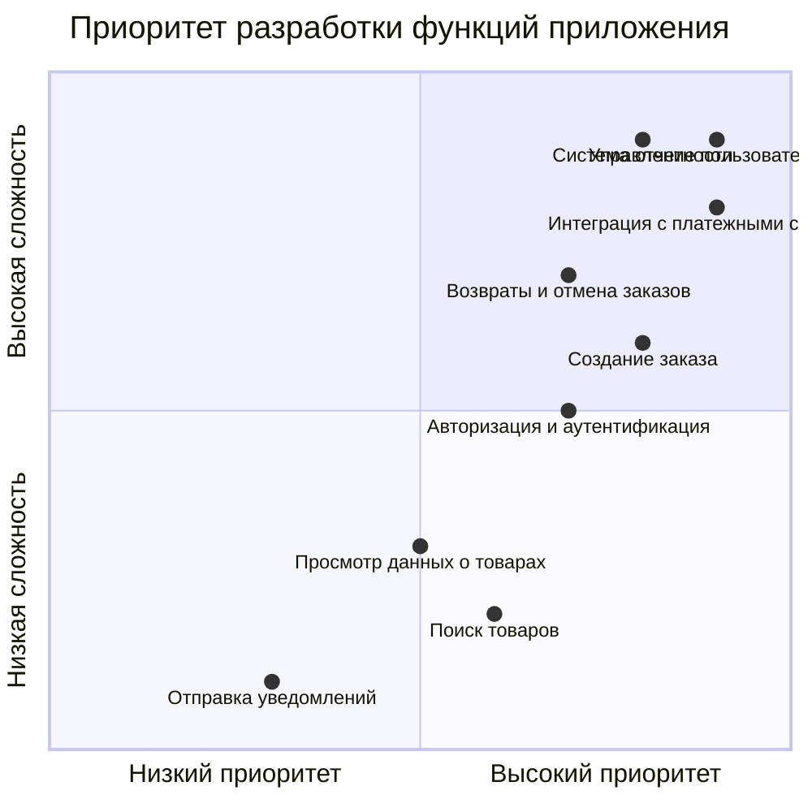
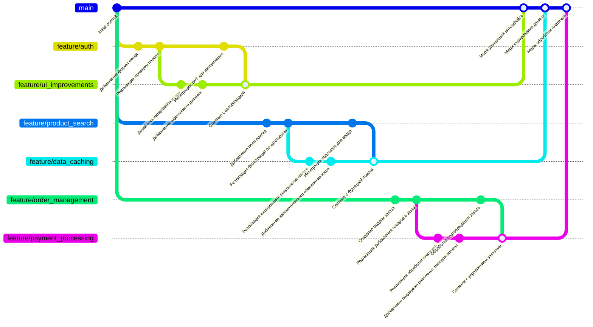

Описание
Архитектура: описывает компоненты клиент-серверной системы, включая клиентскую часть, серверную часть и базу данных.
Задачи проектирования: выделены ключевые аспекты, такие как оптимизация, безопасность и моделирование.
Примеры использования: основные сценарии работы системы.
Диаграмма помогает определить структуру системы, показать взаимодействие компонентов и области для оптимизации.

Диаграмма описывает последовательность действий, начиная с входа пользователя в систему, выполнения операций и завершения сессии. Отражает взаимодействие между клиентской и серверной частями.

Диаграмма представляет оценку функций системы по сложности реализации и приоритетности. Она помогает выделить ключевые задачи, такие как управление пользователями и интеграция с платежными системами.

Эта диаграмма показывает процесс работы с ветками в репозитории Git. Она отражает реализацию различных функций, таких как аутентификация, кэширование данных, обработка платежей и управление заказами.

